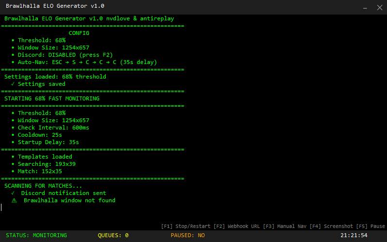

# 🏆 Brawlhalla ELO Generator v1.0

> A fast console-based tool that monitors **Brawlhalla** gameplay and helps you *break the rank* while queueing 🔥

---

  
   
  <em>Live console output while monitoring matches</em>

---

## 🚀 Getting Started

Windows OS

Brawlhalla installed and running

Visual Studio 2026 (recommended)

---

## 📦 Required NuGet Packages

Open **Visual Studio**, then go to:

All required NuGet packages should download automatically when you open and build the project.

---

## ▶️ How to Use

1. Clone or download the repository  
2. Open the project in **Visual Studio**
3. all required NuGet packages should automatically download
4. Build and run the project
5. Launch **Brawlhalla**
6. Let the generator do its thing ✨

---

## ⚙️ Features

- 🔍 Fast screen monitoring
- 🎯 Template matching using OpenCV
- ⚡ Configurable threshold & scan speed
- 🔔 Optional Discord notifications
- 🖥️ Clean real-time console output

---

## ⌨️ Controls

| Key | Action |
|----|-------|
| F1 | Stop / Restart |
| F2 | Toggle Discord Webhook |
| F3 | Manual Navigation |
| F4 | Pause |

---

## ⚠️ Notes

- Windows only
- Brawlhalla must be running
- Intended for **educational and fun purposes**
- Performance may vary depending on resolution & system specs

---

## 💥 Final Words

Break the rank.  
Happy queueing.  
GGs only.
